# GPU-Accelerated Object Counting Pipeline with CUDA

This project uses NVIDIA CUDA to process a large batch of grayscale images on the GPU. The application downloads a large-scale COCO dataset archive, expands it locally, prepares thousands of grayscale images, applies thresholding and morphology on the GPU, and then performs connected-region analysis to compute per-image statistics.

The goal is to demonstrate practical GPU-based image processing on a dataset workload large enough to highlight GPU throughput and parallel processing capabilities.

* * *

## Use case

A practical use case is automated object counting and visual analysis at scale. In many real-world scenarios such as retail analytics, traffic monitoring, or large-image inspection workflows, it is necessary to process large volumes of images and estimate foreground object regions efficiently.

This project demonstrates a simplified version of that workflow using classical image processing techniques accelerated on the GPU.

The pipeline is:
1. Download a large COCO dataset archive
2. Expand the dataset locally
3. Prepare a large batch of grayscale 256×256 images
4. Transfer image data to GPU memory
5. Use CUDA to apply:
   * thresholding
   * erosion
   * dilation
6. Use connected-region analysis to:
   * estimate connected foreground object count
   * calculate per-region statistics
   * generate labeled output
7. Write results to disk:
   * CSV statistics
   * logs
   * sample processed images in both PGM and PNG format

* * *

## What this project demonstrates

* GPU-accelerated image processing using CUDA
* Custom CUDA kernels for thresholding and morphology
* Large-batch processing of thousands of images
* End-to-end pipeline from dataset → prepared images → GPU → output artifacts
* Proof of execution through CSV, logs, and sample images

* * *

## Dataset

This project uses the COCO (Common Objects in Context) dataset.

Dataset preparation for this project:
* download `val2017.zip`
* extract images locally
* convert images to grayscale
* resize to 256×256
* store prepared images under `data/coco/prepared/`

COCO provides a much larger and more diverse image set. This project does not use COCO annotations for category-aware detection. The current pipeline performs thresholding, morphology, and connected-region analysis on prepared grayscale images.

* * *

## GPU processing details

This project uses both:

### Custom CUDA kernels

* thresholding
* erosion
* dilation
* morphology-based cleanup

### Region analysis

* connected-component labeling
* area calculation
* bounding box extraction

* * *

## System Prerequisites

This project was developed and tested on the following setup:

### Hardware

* NVIDIA GPU (Tested on RTX 4070 Laptop GPU)

### Operating System

* Windows 11 with WSL2 (Ubuntu 22.04)

### Software Requirements

#### NVIDIA Drivers

Install latest NVIDIA drivers on Windows.

Verify:

```bash
nvidia-smi
```

#### CUDA Toolkit (inside WSL)
Install CUDA Toolkit inside Ubuntu.

Verify:

```bash
nvcc --version
```

#### Build Tools

```bash
sudo apt update
sudo apt install -y build-essential make python3 python3-pil
```

#### Dataset preparation tools

```bash
sudo apt install -y curl wget unzip imagemagick
```

If `unzip: command not found` appears, install it with:

```bash
sudo apt install -y unzip
```

If COCO download fails with SSL validation using `curl`, try:
* installing/updating CA certificates
* using `wget`
* running from a network without SSL interception

* * *

## Quick Setup Script

You can run the following commands to set up everything:

```bash
# Update system
sudo apt update

# Install build tools and Python imaging support
sudo apt install -y build-essential make python3 python3-pil

# Install dataset preparation tools
sudo apt install -y curl wget unzip imagemagick

# Set CUDA paths if needed
export PATH=/usr/local/cuda/bin:$PATH
export LD_LIBRARY_PATH=/usr/local/cuda/lib64:$LD_LIBRARY_PATH
```

* * *

## Run the Project

You can run the full workflow with:

```bash
bash run.sh
```

Or run the steps manually:

```bash
# Download COCO dataset
bash scripts/download_coco_2017.sh

# Prepare images
python3 scripts/prepare_coco_images.py --limit 5000

# Build
make
# Run
bash run.sh

# Manual run
./bin/coco_object_counter --input-dir data/coco/prepared --max-images 5000 --output-dir output --threshold 140 --min-area 50 --save-samples 7
```

* * *

## Example run

```text
Loaded 5000 prepared images from data/coco/prepared
Processing complete.
Artifacts written to: output
```

* * *

## Output artifacts

After running, the `output/` directory contains:

* `processing_summary.csv`
* `object_stats.csv`
* `run_log.txt`
* `sample_*_mask.pgm`
* `sample_*_cleaned.pgm`
* `sample_*_labeled.pgm`
* `sample_*_mask.png`
* `sample_*_cleaned.png`
* `sample_*_labeled.png`

* * *

## Proof of code execution

* CSV output
  * `output/stats/processing_summary.csv` - https://github.com/ebenezermamidi-bsu/CUDA_Object_Counting/blob/main/output/stats/processing_summary.csv
  * `output/stats/object_stats.csv` - https://github.com/ebenezermamidi-bsu/CUDA_Object_Counting/blob/main/output/stats/object_stats.csv

* logs
  * `output/run_log.txt` - https://github.com/ebenezermamidi-bsu/CUDA_Object_Counting/blob/main/output/run_log.txt

* sample images

| Mask | Cleaned | Labeled |
|------|---------|---------|
| 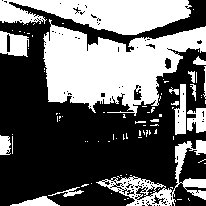 | 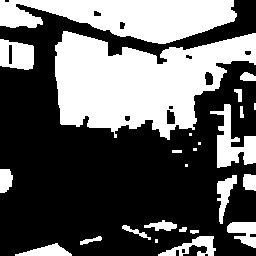 | 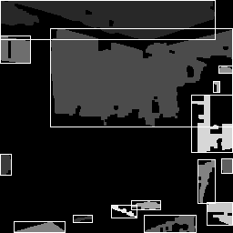 |
|  |  | 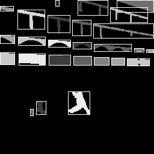 |
| 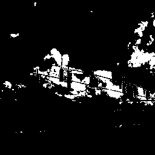 | 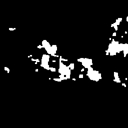 | 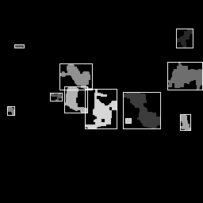 |
|  | 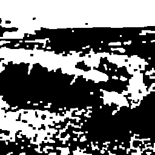 | 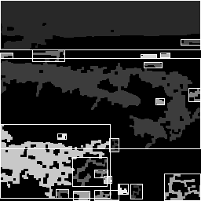 |
| 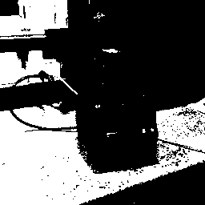 |  | 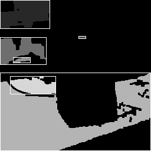 |
|  |  | 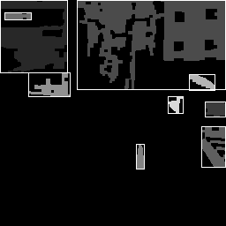 |

* terminal window and output directory screenshot


* * *
